# A Canny Edge Detection for Video Processing on FPGA
The Canny edge detector uses a multi-stage algorithm to detect a wide range of edges in images and has been widely applied in various computer vision systems. 
## Authors
- Raffaele Meloni ([GitHub](https://github.com/rameloni), [LinkedIn](https://www.linkedin.com/in/raffaele-meloni-886a1a208/))
- Leslie Xu ([GitHub](), [LinkedIn]())
- Amirreza Movahedin ([GitHub](), [LinkedIn]())

## Deliverables
<!-- :white_large_square: and :heavy_check_mark: -->
| Deliverable                              | Location                        |
| ---------------------------------------- | ------------------------------- |
| Python implementation (software)         | [py-canny/](py-canny)           |
| HLS implementation (hardware)            | [hls-canny/](hls-canny)         |
| Jupyter notebook for Pynq-Z1 and Pynq-Z2 | [jupyter-canny/](jupyter-canny) |

## Index
- [Algorithm](#algorithm)
- [Software Implementation](#software-implementation)
- [Hardware Implementation in HLS](#hardware-implementation-in-hls)

# Setup

# Algorithm
The Canny edge detection algorithm has 5 stages (plus a preprocessing stage):
- **Grayscale conversion** - Converting the input image to grayscale.
- **Noise Reduction** - Using Gaussian filter to blur the input image and remove the existing noise inside the image.
- **Gradient calculation** - Calculating the intensity gradients of the image.
- **Non-maximum suppression** - Determining the appropriate threshold to avoid recognizing edge wrongly.
- **Double threshold** - Applying a double threshold to determine potential edges.
- **Edge Tracking by Hysteresis** - Pruning edges with weak values and not connected to strong edges.

# Software Implementation
<!-- :white_large_square: and :heavy_check_mark: -->
The software implementation of the Canny edge detection algorithm is done in Python. The code is tested on the PYNQ-Z1 and PYNQ-Z2 boards.
Each stage of the algorithm is implemented in a separate file. A source directory contains all the input images which are read and processed by the code. 
In the [canny.py](py-canny/canny.py) file, the images are processed, shown and stored for each substep.

# Hardware Implementation in **HLS**
The hardware implementation of the Canny edge detection algorithm is done in **HLS**. The code is tested on the PYNQ-Z1 and PYNQ-Z2 boards. 
The hardware realization allows to implement a video processing pipeline. Following steps explains how a canny edge detection is implemented in HLS.

Each pipeline stage is implemented taking care the latency. Divisions and floating point operations are avoided if possible, since they introduce a lot of latency which might exceeds the timing requirements (7ns).

## High-level block diagram
<!-- :white_large_square: and :heavy_check_mark: -->
Video processing pipeline is a sequence of processing blocks that are connected in a chain. Each block is responsible for a specific step.
HDMI modules handle video frames as streams, therefore FIFOs between pipeline steps are used for flow control.
The following diagram shows the high-level block diagram of the Canny edge detection algorithm in hardware.

## **Convolution** in hardware
Hardware handles streams of pixels and it is
not possible to store full frame completely. Therefore there is no way to iterate an input frame enterely. 
We implemented a line buffer and sliding window from scratch to perform convolution. 
The line buffer stores the input frame line by line.

The sliding window is a 2D array that is moved over the line buffer to perform the convolution.

## HLS substages implementation

### Grayscale conversion
It is a preprocessing step that converts the input image to grayscale. The HLS code is implemented in the [grayscale.cpp](hls-canny/grayscale.cpp) file.
There are multiple ways to convert an image to grayscale. The HLS code uses the following formula:
    
    Gray = Red ∗ 0.25 + Green ∗ 0.5 + Blue ∗ 0.25

We chose to use this approximation instead of other well known approaches since it avoids floating point operations and divisions. In fact, it can be implemented in hardware through shift operations which are particurarly suited for FPGAs:

    Gray = (Red + Green << 1 + Blue) >> 2

| Input image                  | Grayscale image                      |
| ---------------------------- | ------------------------------------ |
|  |  |

### Noise reduction -Ggaussian blur
The Canny algorithm is extremely sensitive to noise. Noise reduction allows to detect better the edges in the image.
The Gaussian blur is a common technique used to reduce noise in images using a convolution kernel.

$K(x, y) = \frac{1}{\sqrt{2\pi \sigma^2}} e^{-\frac{x^2+y^2}{2\sigma^2}} =\frac{1}{\sqrt{2\pi}} e^{-\frac{x^2+y^2}{2}}$ for $\sigma = 1$

But it leads to a floating point kernel, which is not well suited for hardware implementation. Therefore, we decided to use an approximation which provides a good trade-off between accuracy and performance. This approximation exploits shift operations and integer arithmetic.
$$\begin{equation*}
    K_{approx} = \frac{1}{256}
    \begin{bmatrix}
    1 & 4 & 6 & 4 & 1 \\
    4 & 16 & 24 & 16 & 4 \\
    6 & 24 & 36 & 24 & 6 \\
    4 & 16 & 24 & 16 & 4 \\
    1 & 4 & 6 & 4 & 1
    \end{bmatrix}
\end{equation*}$$

| Input image (grayscaled)             | Gaussian blur image                          |
| ------------------------------------ | -------------------------------------------- |
|  |  |

### Gradient calculation - Sobel
This step of the pipeline, the intensity and direction of the edges are detected. 
An edge is a sudden change in the intensity of the image. 
The Sobel operator is used to calculate the intensity gradient of the image.
Two kernels are convolutioned with the image to calculate the gradient in the horizontal (y) and vertical (x) direction.
$$\begin{equation*}
    K_x=
    \begin{bmatrix}
    -1 & 0 & 1 \\
    -2 & 0 & 2 \\
    -1 & 0 & 1
    \end{bmatrix},\:
    K_y=
    \begin{bmatrix}
    1 & 2 & 1 \\
    0 & 0 & 0 \\
    -1 & -2 & -1
    \end{bmatrix}
\end{equation*}$$

The convolution prouduces two derivatives in the x and y direction ($I_x, I_y$). 
The gradient magnitude is calculated using an approximation of the Pythagorean theorem in order to save latency: 

$out(x, y) = \sqrt{I_x^2 + I_y^2} \approx |I_x| + |I_y|$.

The gradient direction is calculated using an approximation of the tangent function:

$tan(x, y) \approx \frac{I_y}{I_x}$ this value is compared with known values of the tangent function of 4 direction regions:
- Completely horizontal: 0° or 180° (*from -22.5° to 22.5°*)
- Completely vertical: 90° or 270° (*from 67.5° to 112.5°*)
- Positive slope: 45° or 225° (*from 22.5° to 67.5°*)
- Negative slope: 135° or 315° (*from 112.5° to 157.5°*)

| Input image (grayscaled)             | Sobel image                               |
| ------------------------------------ | ----------------------------------------- |
|  |  |

### Non-maximum suppression
Ideally the final image should have thinner the edges.
The non-maximum suppression step is used to thin the edges in the image.
The gradient direction is used to determine the direction of the edge and the gradient magnitude is used to determine the strength of the edge.

Basing on the direction 2 neighboring pixels are compared to the processed pixel. 
If the intensity of either one of the 2 pixels is higher than the processed pixel, the output pixel (weaker) corresponding to the processed pixel is set to 0. Otherwise, the processed pixel remains its value.

The line buffer and the sliding window are used for the comparison in this step.

Despite the result is not clear in the image below, the effect is more visible once all the steps are combined. In fact in the end we provide a comparison between canny with and without the non maximum suppression step.
| Input image (grayscaled)             | Non-maximum suppression image                                    |
| ------------------------------------ | ---------------------------------------------------------------- |
|  |  |

### Double threshold

| Input image (grayscaled)             | Double threshold image                             |
| ------------------------------------ | -------------------------------------------------- |
|  |  |

### Edge tracking by hysteresis

| Input image (grayscaled)             | Edge tracking by hysteresis image (**Final result**) |
| ------------------------------------ | ---------------------------------------------------- |
|  |    |
### Comparison between Canny with and without non-maximum suppression

| Canny image                    | Canny image (without non-maximum suppression) |
| ------------------------------ | --------------------------------------------- |
|    |            |
|  |          |
|  |          |

## Add custom IP
- Use the example `run.tcl` tcl file to setup the IP diagram on Vivado. `source run.tcl`
- Insert the custom IP there in the video module of the block design.
- Add another AXI master to the interconnect IP already present in the video block.
- Connect the IP to **142 MHz** clock and the corresponding **reset**.

## Other details
- When writing the HLS code, note that it is not software to be executed, but rather a **description of hardware to be generated**.
- Variables will become either wires or registers.
- **Keep track** of how each variable is used. **Think** about hoe the code will be synthesized.
- **HLS also includes several OpenCV functions that can be used in hardware**. These functions provide high-level functionality.
- Target clock **142 MHz**, set the solution synthesis settings using 7ns. *Default frequency of resolution 1128x720 pixels*
- `streamulator` is useful fot testing.
- To use the streamulator both the .cpp and .h files have to be added to the HLS project as simulator source

## Hardware testing
- The student should be confident about whether the code will produce a useful result, to avoid excess time spent waiting. 
- A good idea is to add a control port which allows certain parts of the algorithm to be turned on and off; this can even be left in to provide control of the final block.
- To test a processing block design, the HDMI ports have to be connected directly to each other in Python.
- When done testing, it should be noted that the HDMI connection has to be closed.
- Measuring performance using only the framerate (Video source has 60 fps) **will not yield improvements**. **Other metrics** are needed.
- For example, adding more stages to a video processing pipeline does not impact throughput, but instead adds to the total latency. This can be also used as a metric.
- Also the total utilized area of one's design.

# Report
Link to overleaf document: [report](https://www.overleaf.com/2341325728xzbrcdhtqtpd).

| Done                 | Part                                      |
| -------------------- | ----------------------------------------- |
| :white_large_square: | Descritption of the project functionality |
| :white_large_square: | Experimental setup                        |
| :white_large_square: | Experimental results                      |
| :white_large_square: | Reflection on chosen approach             |
| :white_large_square: | Reflection on achievements                |

# Image comparisons

|                  |                                                                        |                                                                        |                                                              |                                                                                    |
| ---------------- | :--------------------------------------------------------------------: | :--------------------------------------------------------------------: | :----------------------------------------------------------: | :--------------------------------------------------------------------------------: |
| Origin           |                |                |                |        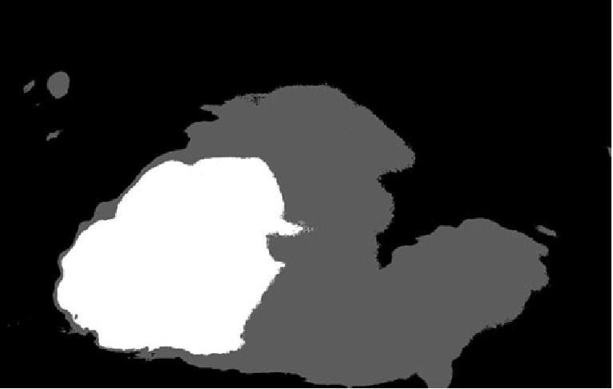        |
| Denoised         |  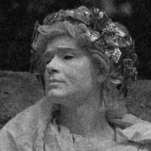  |    |    |    |
| Sobel            |         |         |    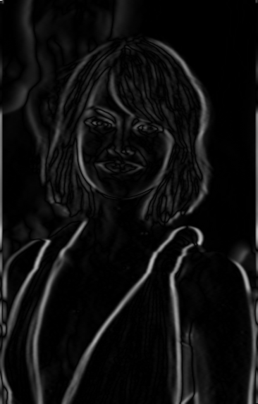     |    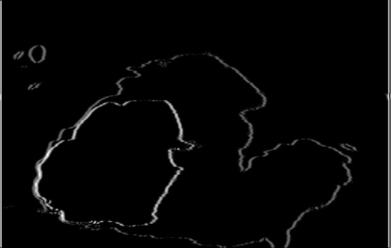     |
| Non max          | 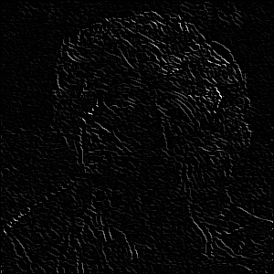 | 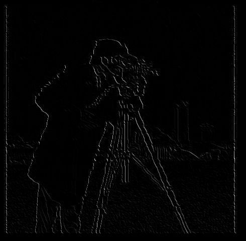 | 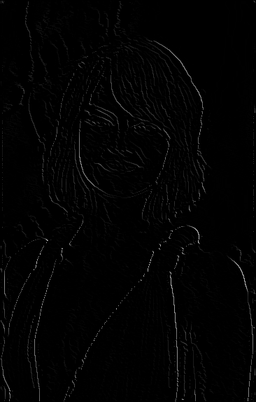 |  |
| Double threshold |   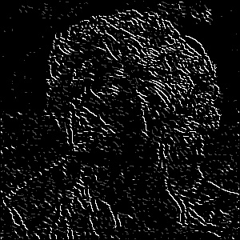    |       |   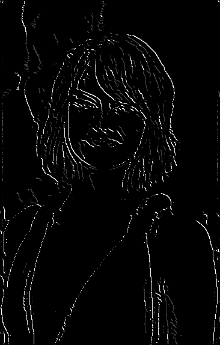    |   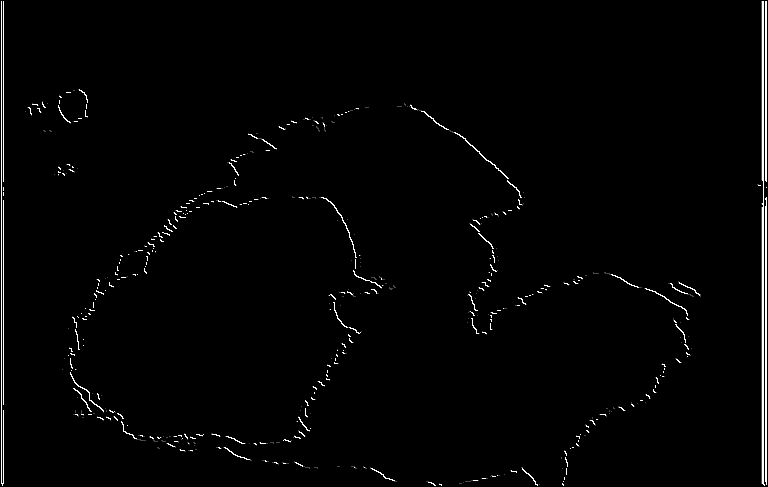    |
| Canny final      |    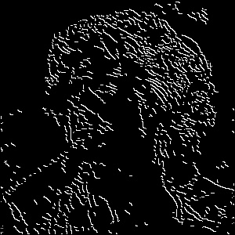     |    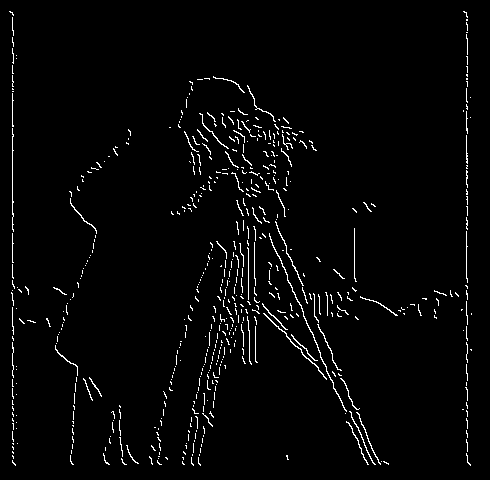     |    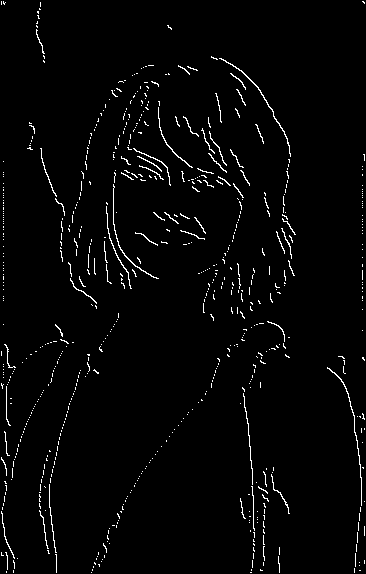     |         |
